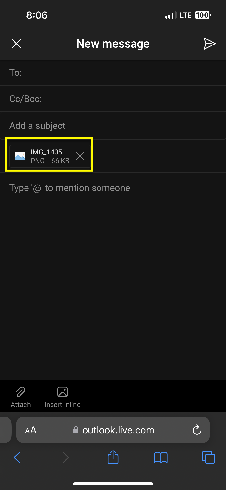

# Adding photos to an email
# Adding a Photo to an email
Adding a photo to an email on both brower(e.g. Google Chrome, Safari, Firefox) or in the outlook app, is similar yet slightly different so i'll cover both method and for each step i've included photos that are all highlighted based on what the step tells you to do.

## In a Browser
### Step 1: Start a new Email
Once you've got your email open your gonna want to start a new email by pressing the + on the bottom right 

### Step 2: Open the attachment menu
To open the attachment menu click on the attachment button in the bottom left corner.

### Step 3: Add your photo
Start off by selecting Photo Library 

Then Select your photo from the gallery and then click add in the top right corner

It should now be attached to email as seen below

## In the outlook App

### Step 1: Start a new Email
Once you've got your app open your gonna want to start a new email by pressing the + on the bottom right

### Step 2: Open the attachment menu
To open the attachment menu click on the attachment button in the bottom left corner above the keyboard.

### Step 3: Add your photo
Start off by selecting Choose Photo From Library 

Then Select your photo from the gallery and then click add in the top right corner

Select Keep original size, this means that it won't compress the image 

It should now be attached to email as seen below

